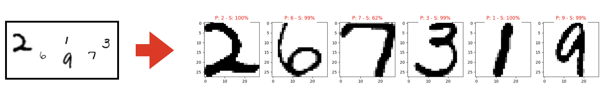
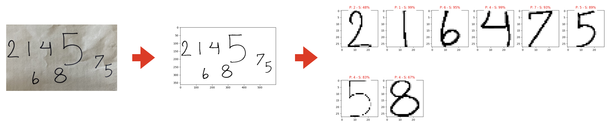
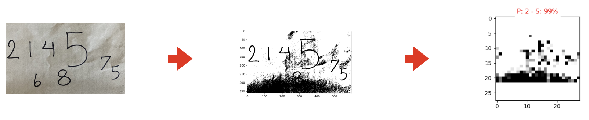

# Handwritten Digit Recognition Using PyTorch + Simple Image Segmentation



## **Description**
This is a simple program made using [PyTorch](https://pytorch.org) for recognizing handwritten digits.

## **How to use?**
Use `main.py`, replace your image path with the default and run the code.

> default: `image_path = 'data/sample/numbers6.jpg'`

> your image: `image_path = 'you_image_path'`

## Programming Language
* `Python`

## Libraries Used
* `torch`
* `torchvision`
* `matplotlib.pyplot`
* `PIL`
* `pandas`
* `sklearn`
* `csv`
* `os`

## **Dataset**
The dataset with name ***Handwritten Digits Dataset (not in MNIST)*** was downloaded from [Kaggle](https://www.kaggle.com/datasets/jcprogjava/handwritten-digits-dataset-not-in-mnist) and is provided by [JC-ProgJava](https://github.com/JC-ProgJava/Handwritten-Digit-Dataset). You can find the repository [here](https://github.com/JC-ProgJava/Handwritten-Digit-Dataset) and the license [here](https://github.com/JC-ProgJava/Handwritten-Digit-Dataset/blob/main/LICENSE.md). 

This dataset is used for educational purposes. If using this dataset violates any law, please let me know.

### Dataset Citation

```bibtex
@misc{jc-progjava_2021,
    title={Handwritten Digits Dataset (not in MNIST)},
    url={https://www.kaggle.com/ds/1090726},
    DOI={10.34740/KAGGLE/DS/1090726},
    publisher={Kaggle},
    author={JC-ProgJava},
    year={2021}
}
```

DOI Citation
```
10.34740/kaggle/ds/1090726
```


## **Repository Features**
* Custom dataset creation based on the PyTorch [tutorial](https://pytorch.org/tutorials/beginner/data_loading_tutorial.html), using `Dataset` and `DataLoader` libraries.
* Data transformation before model training using `torchvision.transforms` libraries and custom transforms based on [PyTorch guidelines](https://pytorch.org/tutorials/beginner/data_loading_tutorial.html#transforms).
* Building a convolutional neural network (CNN) model.
* Training the model and obtaining accuracy for both training and testing data.
* Making the program easy to modify with a configuration file.
* Using the model for predictions, including some simple image segmentation techniques to predict digits in various images.
* Implementing simple anomaly detection techniques to ignore non-digit objects in predictions.

## `models_archive` Directory
* `model_-1.pth`: trained model by using the whole dataset.
* `model_2000.pth`: trained model by using a subset of 2000 samples.
* `model_5000.pth`: trained model by using a subset of 5000 samples.


## **Challenges**
One challenge in image segmentation is using a simple manual grayscale modifier to make digits clear for segmentation. This modification involves adjusting a threshold, with different threshold values producing different results. For example:

Threshold = `0.3`:


Threshold = `0.6`:


There are ways to improve this, such as normalizing tensor values and checking and linking results with/to `softmax` output. These improvements may be included in future updates.

## **Final Note**
This is a simple neural network project for educational purposes. Better prediction requires a larger dataset and more advanced image segmentation techniques to recognize digits accurately and ignore anomalies.
